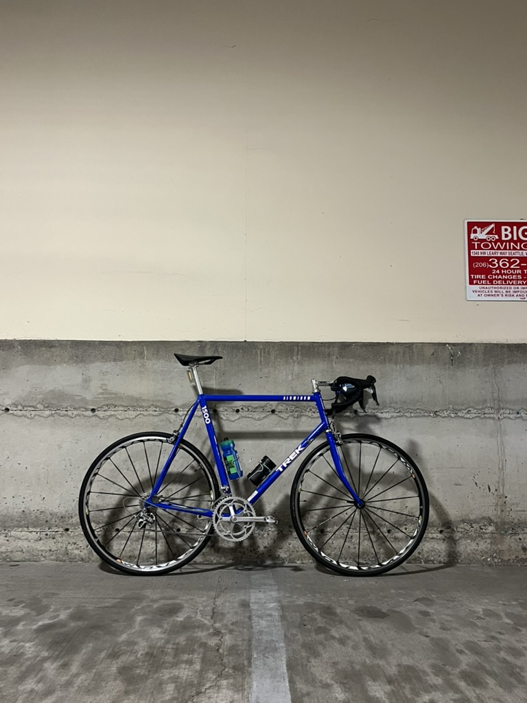
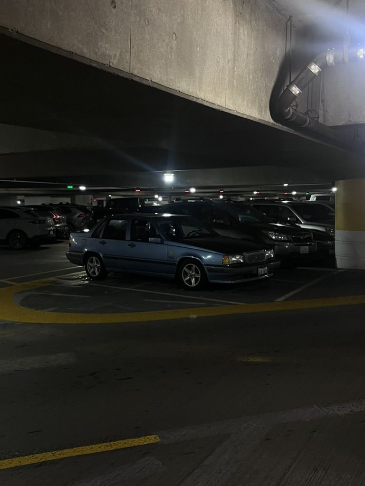

# Reed Bayless

> I am a fourth-year student at UW studying data visualization, web mapping, and GIS.

## Education:
- University of Washington
- Majoring in Data Science & Geography
- Graduating this spring

## Skills:
- github
- HTML / CSS / Java / Python / R
- Gis programs ( arcGIS, Qgis )

## Profiles:
[GitHub Profile](https://github.com/bayn3t)

[Strava](https://www.strava.com/athletes/45053654)

## Some cool photos I have taken recently:

